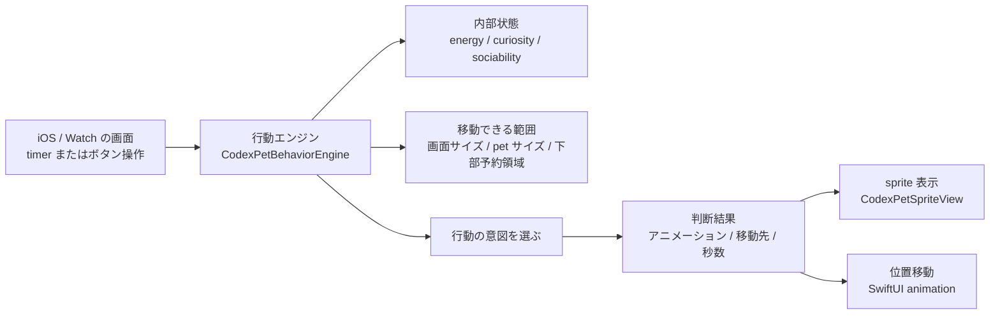
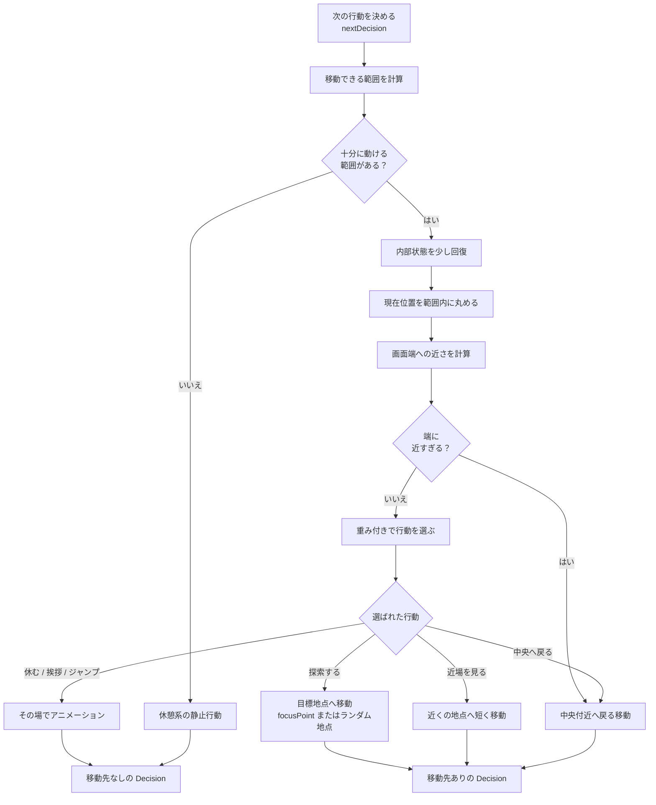
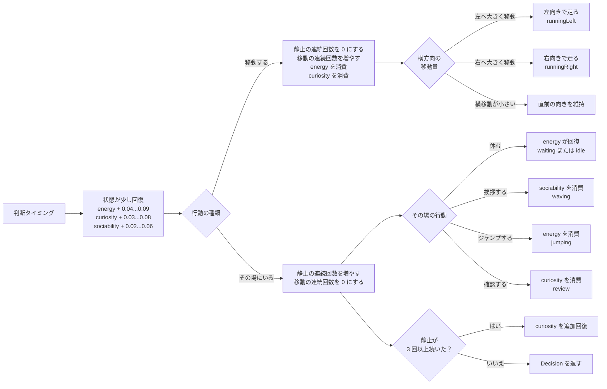

# Behavior Engine

`CodexPetBehaviorEngine` は、iOS / watchOS のデモアプリで pet の自律行動を決めるための軽量な状態ベースエンジンです。単純なランダム移動ではなく、内部状態、現在位置、表示領域、画面端への近さを組み合わせて次のアニメーションと移動先を返します。

実装は [CodexPetBehaviorEngine.swift](../Sources/CodexPetWatchSprite/CodexPetBehaviorEngine.swift) にあります。

## Goals

- pet が画面内を自然に移動し、ときどき立ち止まるようにする
- 画面端に寄りすぎた場合は中央付近へ戻す
- 操作 UI や Watch の小さな画面で pet が隠れないよう、移動可能範囲を制限する
- 呼び出し側は `Decision` を SwiftUI animation に反映するだけで済むようにする

## Public API

### `CodexPetBehaviorEngine`

```swift
public struct CodexPetBehaviorEngine {
    public init(
        energy: Double = 0.72,
        curiosity: Double = 0.62,
        sociability: Double = 0.45
    )

    public mutating func reset()

    public mutating func nextDecision(
        currentPosition: CGPoint,
        containerSize: CGSize,
        petSize: CGSize,
        bottomReservedHeight: CGFloat = 0
    ) -> Decision

    public mutating func nextMovementDecision(
        currentPosition: CGPoint,
        containerSize: CGSize,
        petSize: CGSize,
        bottomReservedHeight: CGFloat = 0
    ) -> Decision
}
```

`energy`、`curiosity`、`sociability` は `0...1` に丸められます。初期値は、起動直後にある程度動き、休憩や挨拶も混ざるバランスにしています。

### `Decision`

```swift
public struct Decision: Equatable {
    public let animation: CodexPetSpriteView.Animation
    public let targetPosition: CGPoint?
    public let duration: TimeInterval

    public var isMovement: Bool
}
```

- `animation`: 次に表示する sprite animation
- `targetPosition`: 移動する場合の中心座標。静止行動では `nil`
- `duration`: 行動の基準秒数。呼び出し側で速度プリセットを掛けられる
- `isMovement`: `targetPosition != nil` の補助プロパティ

## Internal State

エンジンは以下の状態を持ちます。

| State | Meaning |
| --- | --- |
| `energy` | 高いほど移動やジャンプを選びやすく、移動すると減る |
| `curiosity` | 高いほど探索や近場の確認を選びやすく、探索や確認で減る |
| `sociability` | 高いほど挨拶を選びやすく、挨拶で減る |
| `focusPoint` | 探索中に継続して向かう目標地点 |
| `stationaryStreak` | 静止行動が続いた回数。続くほど探索しやすくなる |
| `movementStreak` | 移動行動が続いた回数。続くほど休憩しやすくなる |
| `facingAnimation` | 横移動が小さい場合に維持する向き |

`nextDecision` / `nextMovementDecision` を呼ぶたびに `updateNeeds()` が走り、`energy`、`curiosity`、`sociability` が少しずつ回復します。

## Intent Model

内部では `Intent` を選び、最終的に `Decision` へ変換します。

| Intent | Result |
| --- | --- |
| `returnToComfortZone` | 中央付近へ移動 |
| `explore` | ランダムな地点、または継続中の `focusPoint` へ移動 |
| `inspect` | 現在位置の近くへ短く移動。距離が短すぎる場合は `review` |
| `rest` | `waiting` または `idle` |
| `greet` | `waving` |
| `celebrate` | `jumping` |

`nextMovementDecision` は UI の「移動」操作向けで、通常の重み付けを使わず、見た目に分かりやすい横断移動を返します。

## 全体像

この図は、画面側の timer やボタン操作から行動エンジンが呼ばれ、返ってきた `Decision` が sprite 表示と位置アニメーションに反映されるまでの関係を示します。エンジンは SwiftUI の状態管理を直接持たず、「次に何をするか」だけを決めます。



## 判断フロー

`nextDecision` の流れは次の通りです。

1. `containerSize`、`petSize`、`bottomReservedHeight` から移動可能範囲を作る
2. 移動可能範囲が小さすぎる場合は休憩系の静止行動を返す
3. 内部状態を少し回復する
4. 現在位置を移動可能範囲内に丸める
5. 画面端への近さから `edgePressure` を計算する
6. `edgePressure > 0.82` の場合は中央付近へ戻す
7. それ以外は重み付き抽選で intent を選ぶ
8. intent を移動または静止の `Decision` に変換する

この図では、pet が画面端に近すぎる場合は他の行動より先に中央付近へ戻し、それ以外のときだけ重み付きで行動を選ぶ流れを表しています。



## Weighting

通常時の intent は重み付きで選ばれます。

| Weight | Formula | Effect |
| --- | --- | --- |
| rest | `(1 - energy) * 2.2 + movementStreak * 0.28` | 疲れている、または移動が続くほど休みやすい |
| explore | `curiosity * 1.4 + stationaryStreak * 0.2` | 好奇心が高い、または静止が続くほど探索しやすい |
| inspect | `curiosity * 0.9 + energy * 0.45` | 好奇心と体力があると近場を確認しやすい |
| greet | `sociability * 0.9` | 社交性が高いと挨拶しやすい |
| celebrate | `energy * 0.35 + sociability * 0.2` | 体力と社交性があるとジャンプしやすい |
| return | `edgePressure * 1.8` | 端に近いほど中央付近へ戻りやすい |

画面端にかなり近い場合は、この重み付けより先に `returnToComfortZone` が強制されます。

## Movement Bounds

移動範囲は pet の中心座標として計算します。

- `minX`: `petSize.width / 2`
- `maxX`: `containerSize.width - petSize.width / 2`
- `minY`: `petSize.height / 2`
- `maxY`: `containerSize.height - bottomReservedHeight - petSize.height / 2`

`bottomReservedHeight` は iOS の調整パネルや Watch の操作ボタンなど、pet を重ねたくない下部領域を表します。負の値は `0` として扱われます。

## Movement Decisions

移動行動では以下を行います。

- `stationaryStreak` を `0` に戻す
- `movementStreak` を増やす
- `energy` を減らす
- `curiosity` を減らす。`explore` は通常の移動より多く減る
- 距離が `6pt` 未満なら `inspect` の静止行動にフォールバックする
- 移動時間は `distance / 95` を `0.75...1.8` 秒に丸める
- 横方向の差が `-4pt` 未満なら `runningLeft`
- 横方向の差が `4pt` より大きければ `runningRight`
- 横方向の差が小さい場合は直前の向きを維持する

## Stationary Decisions

静止行動では以下を行います。

- `stationaryStreak` を増やす
- `movementStreak` を `0` に戻す
- intent ごとに内部状態を消費または回復する

| Intent | Animation | Duration | State Change |
| --- | --- | --- | --- |
| `rest` | `waiting` or `idle` | `1.4` | `energy + 0.18` |
| `greet` | `waving` | `1.2` | `sociability - 0.35` |
| `celebrate` | `jumping` | `1.1` | `energy - 0.16` |
| `inspect` | `review` | `1.5` | `curiosity - 0.14` |
| `returnToComfortZone` / `explore` fallback | `idle` | `1.2` | no direct change |

静止が 3 回以上続くと `curiosity` が追加で回復し、次回以降に動きやすくなります。

## 状態更新

この図は、1 回の判断で `energy`、`curiosity`、`sociability`、連続移動回数、連続静止回数がどう変わるかを示します。基本的には、時間経過で少し回復し、移動や挨拶などの行動で対応する状態を消費します。



## UI Integration

iOS / Watch のデモアプリでは、一定間隔の timer で `nextDecision` を呼びます。

呼び出し側の責務は次の通りです。

- ドラッグ中や固定フレーム表示中は自律行動を止める
- 前の移動が終わるまでは次の判断を行わない
- `Decision.animation` を `CodexPetSpriteView` に渡す
- `Decision.targetPosition` がある場合は SwiftUI animation で `petPosition` を更新する
- `Decision.duration` に `CodexPetAnimationSpeedPreset.movementDurationScale` を掛ける
- 行動終了後に一時的な `behaviorAnimation` と移動状態をクリアする

この分担により、エンジンは SwiftUI の状態管理やタイマーには依存しません。

## Testing Notes

現在のテストでは以下の振る舞いを確認しています。

- 画面端にいる場合、移動可能範囲内へ戻る判断を返す
- 移動できないほど小さい container では静止判断を返す
- 強制移動 API は横方向に分かりやすく移動する
- animation speed preset が移動時間に反映できる

乱数を直接使う実装なので、今後より細かい intent の比率や状態遷移をテストしたい場合は、乱数生成を注入可能にする必要があります。

## Extension Points

今後拡張する場合は、以下の順に検討すると影響範囲を抑えやすくなります。

1. 新しい animation を `CodexPetSpriteView.Animation` に追加する
2. 必要なら `Intent` を追加する
3. `chooseIntent` に重みを追加する
4. `movementDecision` または `stationaryDecision` で状態変化と duration を定義する
5. Swift Testing で新しい振る舞いを固定する

新しい依存関係は不要です。状態量を増やす場合は、`reset()` と初期値の意味も合わせて更新してください。
